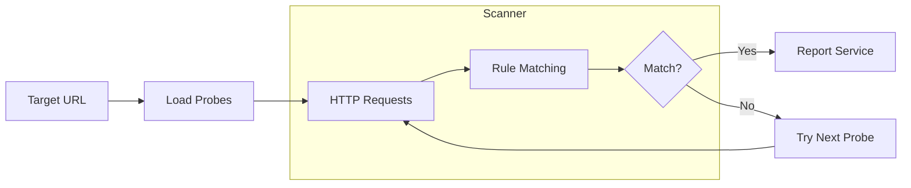

# Julius: LLM Service Fingerprinting Tool

> Identify Ollama, vLLM, LiteLLM, and 30+ AI services running on any endpoint in seconds.

[](https://golang.org/)
[](LICENSE)
[](https://github.com/praetorian-inc/julius/actions)
[](https://goreportcard.com/report/github.com/praetorian-inc/julius)

**Julius** is an LLM service fingerprinting tool for security professionals. It detects which AI server software is running on network endpoints during penetration tests, attack surface discovery, and security assessments.

Unlike model fingerprinting tools that identify which LLM generated text, Julius identifies the **server infrastructure**: Is that endpoint running Ollama? vLLM? LiteLLM? A Hugging Face deployment? Julius answers in seconds.

## Table of Contents

- [The Problem](#the-problem)
- [Features](#features)
- [Quick Start](#quick-start)
- [Supported LLM Services](#supported-llm-services)
- [Usage](#usage)
  - [Single Target](#single-target)
  - [Multiple Targets](#multiple-targets)
  - [Output Formats](#output-formats)
  - [Model Discovery](#model-discovery)
- [How It Works](#how-it-works)
- [Architecture](#architecture)
- [Adding Custom Probes](#adding-custom-probes)
- [FAQ](#faq)
- [Troubleshooting](#troubleshooting)
- [Contributing](#contributing)
- [Security](#security)
- [Support](#support)
- [License](#license)

## The Problem

You've discovered an open port during a security assessment. Is it Ollama on port 11434? vLLM? LiteLLM? A Hugging Face endpoint? Some other AI service?

**Manually checking each possibility is slow and error-prone.** Different LLM services have different API signatures, default ports, and response patterns.

**Julius solves this by automatically fingerprinting LLM services** - sending targeted HTTP probes and matching response signatures to identify the exact service running.

## Features

| Feature | Description |
|---------|-------------|
| **32 LLM Services** | Detects Ollama, vLLM, LiteLLM, LocalAI, Hugging Face TGI, and 27 more |
| **Fast Scanning** | Concurrent probing with intelligent port-based prioritization |
| **Model Discovery** | Extracts available models from identified endpoints |
| **Specificity Scoring** | 1-100 scoring ranks results by most specific match (e.g., LiteLLM over generic OpenAI-compatible) |
| **Multiple Inputs** | Single target, file input, or stdin piping |
| **Flexible Output** | Table, JSON, or JSONL formats for easy integration |
| **Extensible** | Add new service detection via simple YAML probe files |
| **Offline Operation** | No cloud dependencies - runs entirely locally |
| **Single Binary** | Go-based tool compiles to one portable executable |

## Quick Start

### Installation

```bash
go install github.com/praetorian-inc/julius/cmd/julius@latest
```

### Basic Usage

```bash
julius probe https://target.example.com
```

### Example Output

```
+----------------------------+---------+-------------+-------------+--------+-------+
|           TARGET           | SERVICE | SPECIFICITY |  CATEGORY   | MODELS | ERROR |
+----------------------------+---------+-------------+-------------+--------+-------+
| https://target.example.com | ollama  |         100 | self-hosted |        |       |
+----------------------------+---------+-------------+-------------+--------+-------+
```

## Supported LLM Services

Julius identifies 32 LLM platforms across self-hosted, gateway, RAG/orchestration, and cloud-managed categories:

### Self-Hosted LLM Servers

| Service | Default Port | Description |
|---------|--------------|-------------|
| [Ollama](https://ollama.ai) | 11434 | Popular local LLM server with easy model management |
| [vLLM](https://github.com/vllm-project/vllm) | 8000 | High-throughput LLM inference engine |
| [LocalAI](https://localai.io) | 8080 | OpenAI-compatible local AI server |
| [llama.cpp](https://github.com/ggerganov/llama.cpp) | 8080 | CPU-optimized LLM inference |
| [Hugging Face TGI](https://huggingface.co/docs/text-generation-inference) | 3000 | Text Generation Inference server |
| [LM Studio](https://lmstudio.ai) | 1234 | Desktop LLM application with API server |
| [Aphrodite Engine](https://github.com/PygmalionAI/aphrodite-engine) | 2242 | Large-scale LLM inference engine with OpenAI-compatible API |
| [FastChat](https://github.com/lm-sys/FastChat) | 21001 | Open platform for training, serving, and evaluating LLM chatbots |
| [GPT4All](https://gpt4all.io) | 4891 | Run local models on any device |
| [Gradio](https://gradio.app) | 7860 | ML model demo interfaces |
| [Jan](https://jan.ai) | 1337 | Local OpenAI-compatible API server |
| [KoboldCpp](https://github.com/LostRuins/koboldcpp) | 5001 | Easy-to-use AI text-generation software for GGML/GGUF models |
| [NVIDIA NIM](https://developer.nvidia.com/nim) | 8000 | NVIDIA's enterprise inference microservices |
| [TabbyAPI](https://github.com/theroyallab/tabbyAPI) | 5000 | FastAPI-based LLM server for ExLlama |
| [Text Generation WebUI](https://github.com/oobabooga/text-generation-webui) | 5000 | Local LLM interface with OpenAI-compatible API |

### Gateway/Proxy Services

| Service | Default Port | Description |
|---------|--------------|-------------|
| [LiteLLM](https://github.com/BerriAI/litellm) | 4000 | Unified proxy for 100+ LLM providers |
| [Kong AI Gateway](https://konghq.com) | 8000 | Enterprise API gateway with AI plugins |
| [Envoy AI Gateway](https://gateway.envoyproxy.io) | 80 | Unified access to generative AI services built on Envoy Gateway |

### RAG & Orchestration Platforms

| Service | Default Port | Description |
|---------|--------------|-------------|
| [AnythingLLM](https://anythingllm.com) | 3001 | All-in-one AI application with RAG, agents, and multi-model support |
| [AstrBot](https://github.com/Soulter/AstrBot) | 6185 | Multi-platform LLM chatbot framework with dashboard and plugin system |
| [BetterChatGPT](https://github.com/ztjhz/BetterChatGPT) | 3000 | Enhanced ChatGPT interface |
| [Dify](https://dify.ai) | 80 | Open-source LLM app development platform with workflow orchestration |
| [Flowise](https://flowiseai.com) | 3000 | Low-code platform for building AI agents and LLM workflows |
| [HuggingFace Chat UI](https://github.com/huggingface/chat-ui) | 3000 | Open source ChatGPT-style interface powering HuggingChat |
| [LibreChat](https://librechat.ai) | 3080 | Multi-provider chat interface with RAG support |
| [LobeHub](https://lobehub.com) | 3210 | Multi-agent AI collaboration platform with chat UI |
| [NextChat](https://github.com/ChatGPTNextWeb/ChatGPT-Next-Web) | 3000 | Self-hosted ChatGPT-style interface supporting multiple AI providers |
| [Onyx](https://github.com/onyx-dot-app/onyx) | 3000 | Open source AI platform for enterprise search and chat with RAG |
| [Open WebUI](https://github.com/open-webui/open-webui) | 3000 | ChatGPT-style interface for local LLMs |
| [SillyTavern](https://sillytavernai.com) | 8000 | Character-based chat application |

### Cloud-Managed Services

| Service | Default Port | Description |
|---------|--------------|-------------|
| [Salesforce Einstein](https://www.salesforce.com/einstein/) | 443 | Salesforce AI platform |

### Generic Detection

| Service | Description |
|---------|-------------|
| OpenAI-compatible | Any server implementing OpenAI's API specification |

## Usage

### Single Target

Scan a single endpoint for LLM services:

```bash
julius probe https://target.example.com
julius probe https://target.example.com:11434
julius probe 192.168.1.100:8080
```

### Multiple Targets

Scan multiple endpoints efficiently:

```bash
# Command line arguments
julius probe https://target1.example.com https://target2.example.com

# From file (one target per line)
julius probe -f targets.txt

# From stdin (pipe from other tools)
cat targets.txt | julius probe -
echo "https://target.example.com" | julius probe -
```

### Output Formats

Choose the output format that fits your workflow:

```bash
# Table format (default) - human-readable
julius probe https://target.example.com

# JSON format - structured output
julius probe -o json https://target.example.com

# JSONL format - one JSON object per line, ideal for piping
julius probe -o jsonl https://target.example.com | jq '.service'
```

### Model Discovery

When Julius identifies an LLM service, it can also extract available models:

```bash
julius probe -o json https://ollama.example.com | jq '.models'
```

```json
{
  "target": "https://ollama.example.com",
  "service": "ollama",
  "models": ["llama2", "mistral", "codellama"]
}
```

### Advanced Options

```bash
# Adjust concurrency (default: 10)
julius probe -c 20 https://target.example.com

# Increase timeout for slow endpoints (default: 5 seconds)
julius probe -t 10 https://target.example.com

# Use custom probe definitions
julius probe -p ./my-probes https://target.example.com

# Verbose output for debugging
julius probe -v https://target.example.com

# Quiet mode - only show matches
julius probe -q https://target.example.com

# List all available probes
julius list
```

## How It Works

Julius uses HTTP-based service fingerprinting to identify LLM platforms:



### Detection Process

1. **Target Normalization**: Validates and normalizes input URLs
2. **Probe Selection**: Prioritizes probes matching the target's port
3. **HTTP Probing**: Sends requests to service-specific endpoints
4. **Rule Matching**: Compares responses against signature patterns
5. **Specificity Scoring**: Orders results by most specific match first
6. **Model Extraction**: Optionally retrieves available models via JQ expressions

### Match Rules

Each probe defines rules that must all match for identification:

| Rule Type | Description | Example |
|-----------|-------------|---------|
| `status` | HTTP status code | `200`, `404` |
| `body.contains` | Response body contains string | `"models":` |
| `body.prefix` | Response body starts with | `{"object":` |
| `content-type` | Content-Type header equals value | `application/json` |
| `header.contains` | Header contains value | `X-Custom: foo` |
| `header.prefix` | Header starts with value | `text/` |

All rules support negation with `not: true`.

## Architecture

```
cmd/julius/          CLI entrypoint
pkg/
  runner/            Command execution (probe, list, validate)
  scanner/           HTTP client, response caching, model extraction
  rules/             Match rule engine (status, body, header patterns)
  output/            Formatters (table, JSON, JSONL)
  probe/             Probe loader (embedded YAML + filesystem)
  types/             Core data structures
probes/              YAML probe definitions (one per service)
```

### Key Design Decisions

- **Concurrent scanning** with bounded goroutine pools via `errgroup`
- **Response caching** with MD5 deduplication and `singleflight`
- **Embedded probes** compiled into binary for portability
- **Plugin-style rules** for easy extension
- **Port-based prioritization** for faster identification

## Adding Custom Probes

Create a YAML file in `probes/` to detect new LLM services:

```yaml
name: my-llm-service
description: My custom LLM service detection
category: self-hosted
port_hint: 8080
api_docs: https://example.com/api-docs

requests:
  - path: /health
    method: GET
    match:
      - type: status
        value: 200
      - type: body.contains
        value: '"service":"my-llm"'

  - path: /api/version
    method: GET
    match:
      - type: status
        value: 200
      - type: content-type
        value: application/json

models:
  path: /api/models
  method: GET
  extract: ".models[].name"
```

Validate your probe:

```bash
julius validate ./probes
```

See [CONTRIBUTING.md](CONTRIBUTING.md) for the complete probe specification.

## FAQ

### What is LLM service fingerprinting?

LLM service fingerprinting identifies what **LLM server software** (Ollama, vLLM, LiteLLM, etc.) is running on a network endpoint. This differs from **model fingerprinting**, which identifies which AI model generated a piece of text.

**Julius answers**: "What server is running on this port?"
**Model fingerprinting answers**: "Which LLM wrote this text?"

### How is Julius different from Shodan-based detection?

Tools like Cisco's Shodan-based Ollama detector query internet-wide scan databases. Julius performs **active probing** against specific targets you control, working offline without external dependencies. It also detects 30+ services versus single-service detection.

### Is Julius safe for penetration testing?

Yes. Julius only sends standard HTTP requests - the same as a web browser or curl. It does not:

- Exploit vulnerabilities
- Attempt authentication bypass
- Perform denial of service
- Modify or delete data
- Execute code on targets

Always ensure you have authorization before scanning targets.

### How do I add support for a new LLM service?

1. Create a YAML probe file in `probes/` (e.g., `probes/my-service.yaml`)
2. Define HTTP requests with match rules
3. Validate with `julius validate ./probes`
4. Test against a live instance
5. Submit a pull request

See [CONTRIBUTING.md](CONTRIBUTING.md) for detailed examples.

### Why doesn't Julius detect my LLM service?

Common reasons:

1. **Non-default port**: Try specifying the full URL with port
2. **Authentication required**: Julius doesn't handle auth; the endpoint may be protected
3. **Custom configuration**: The service may have non-standard API paths
4. **Unsupported service**: Consider [adding a custom probe](#adding-custom-probes)

### Can Julius detect services behind reverse proxies?

Yes, if the proxy forwards requests to the backend LLM service endpoints. Julius matches on response content, not network-level signatures.

### Why "Julius"?

Named after Julius Caesar - the original fingerprinter of Roman politics.

## Troubleshooting

### Error: "no matches found"

**Cause**: No probe signatures matched the target's responses.

**Solutions**:
1. Verify the target URL is correct and accessible
2. Check if the service requires authentication
3. Try with verbose mode: `julius probe -v https://target`
4. The service may not be in Julius's probe database - consider adding a custom probe

### Error: "connection refused"

**Cause**: Target is not accepting connections on the specified port.

**Solutions**:
1. Verify the target host and port are correct
2. Check if a firewall is blocking the connection
3. Ensure the LLM service is running

### Error: "timeout"

**Cause**: Target didn't respond within the timeout period.

**Solutions**:
1. Increase timeout: `julius probe -t 15 https://target`
2. Check network connectivity to the target
3. The service may be overloaded or unresponsive

### Slow scanning performance

**Cause**: Default concurrency may be too low for many targets.

**Solutions**:
1. Increase concurrency: `julius probe -c 50 -f targets.txt`
2. Use JSONL output for faster streaming: `julius probe -o jsonl -f targets.txt`

## Contributing

We welcome contributions! See [CONTRIBUTING.md](CONTRIBUTING.md) for:

- Adding new LLM service probes
- Creating new match rule types
- Testing guidelines
- Code style requirements

## Security

Julius is designed for **authorized security testing only**. See [SECURITY.md](SECURITY.md) for:

- Security considerations and responsible use
- What Julius does and does not do
- Reporting security issues

## Support

If you find Julius useful, please consider:

- Giving it a **star** on GitHub
- [Opening an issue](https://github.com/praetorian-inc/julius/issues) for bugs or feature requests
- [Contributing](CONTRIBUTING.md) new LLM service probes
- Joining [GitHub Discussions](https://github.com/praetorian-inc/julius/discussions) for questions

[](https://star-history.com/#praetorian-inc/julius&Date)

## License

[Apache 2.0](LICENSE) - Praetorian Security, Inc.

---

**Built by [Praetorian](https://www.praetorian.com/)** - Offensive Security Solutions
